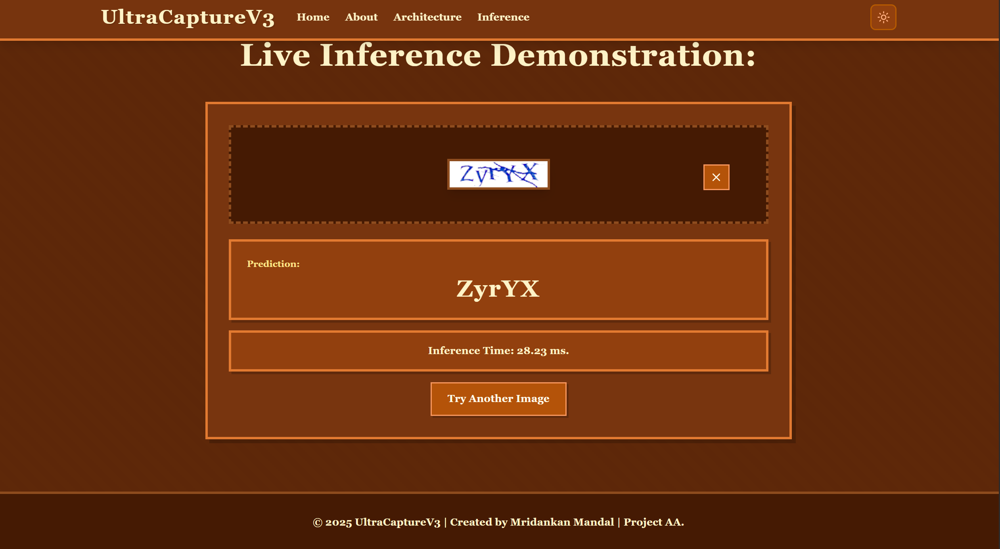

# UltraCaptureV3 - Advanced CAPTCHA Recognition Web Application:

A modern, retro-styled web application for recognizing CAPTCHA images using a hybrid CRNN (Convolutional Recurrent Neural Network) architecture with attention mechanisms. The application features CPU-based ONNX inference for fast, cross-platform deployment without GPU requirements.

© 2025 UltraCaptureV3 | Created by Mridankan Mandal | Project AA.


The UltraCaptureV3 application features a retro-styled interface with a vintage aesthetic, displaying the project title, accuracy metrics, and creator information on the home page.

---

## Features:

- **High Accuracy**: Achieves **95.08% Character Accuracy** and **86.37% Sequence Accuracy** on test sets.
- **Advanced Architecture**: Hybrid CRNN combining ResNet-style CNN backbone, CBAM attention, Bi-LSTM, and Transformer Encoder.
- **CPU-Based Inference**: Uses ONNX Runtime for fast, optimized CPU inference (30-100ms per image) without GPU requirements.
- **Retro/Vintage Design**: Beautiful single-page application with retro aesthetic, dark/light theme toggle, and responsive layout.
- **Easy Deployment**: Simple setup with PowerShell scripts for automated environment configuration.
- **Web-Based Interface**: Intuitive drag-and-drop image upload with real-time predictions and inference timing.
- **Cross-Platform**: Works on Windows, macOS, and Linux with Python 3.11+ and Node.js.



The Inference section provides an interactive drag-and-drop interface for uploading CAPTCHA images, displaying predictions, and showing inference timing information in real-time.

---

## Model Architecture:

The model is a custom-built Convolutional Recurrent Neural Network (CRNN) that integrates multiple advanced concepts for maximum accuracy:

- **Stage 1 - Feature Extraction**: Deep CNN with ResNet-style residual blocks enhanced with CBAM (Convolutional Block Attention Module) for channel and spatial attention.
- **Stage 2 - Sequence Modeling**: Bidirectional LSTM processes feature sequences, refined by Transformer Encoder for long-range dependencies.
- **Loss Function**: Connectionist Temporal Classification (CTC) for unsegmented sequence learning.

**Key Specifications:**
- Input Size: 64×256 pixels (RGB).
- Hidden Size: 512.
- Attention Heads: 8.
- Transformer Layers: 4.
- Charset: 62 characters (0-9, A-Z, a-z).
- Model Size: ~273MB (ONNX format).


The architecture section displays the CRNN model components in a retro-styled card layout, showing the convolutional backbone, CBAM attention mechanism, Bi-LSTM, and Transformer Encoder with their respective descriptions.

-----

## Dataset and Performance:

### Dataset:

The model was trained on the **Huge CAPTCHA Dataset** that's been made by the author, **Mridankan Mandal**, which has been made available on Kaggle. This dataset contains a large number of CAPTCHA images with alphanumeric characters, where the label for each image is its filename.

  * **Link**: [Huge CAPTCHA Dataset on Kaggle](https://www.kaggle.com/datasets/redzapdos123/huge-captcha-dataset)

### Performance Metrics:

The model achieves high accuracy on both the validation and unseen test sets.

| Metric             | Validation Set | Test Set |
| ------------------ | :------------: | :------: |
| Sequence Accuracy  |     86.4%      | 86.37%   |
| Character Accuracy |     95.1%      | 95.08%   |


The performance metrics table displays the model's accuracy on validation and test sets, showing both sequence accuracy and character accuracy metrics.

---

## 🚀 Quick Start:

### Prerequisites:

- **Python** 3.11 (recommended) or 3.8+.
- **Node.js** 18.0 or higher.
- **Git** (optional, for cloning the repository).

### Installation (Automated):

The easiest way to set up the application is using the provided PowerShell script:

```powershell
.\setup.ps1
```

This script will automatically:
- Check for Python and Node.js installation.
- Create a Python virtual environment.
- Install all backend dependencies (ONNX Runtime, Flask, etc.).
- Install all frontend dependencies.
- Verify the ONNX model exists.

### Running the Application:

Start both the backend and frontend servers with:

```powershell
.\start.ps1
```

Then open your browser and navigate to:
```
http://localhost:5173
```

For detailed setup and usage instructions, see:
- **[Installation and Setup Guide](InstallationAndSetup.md)** - Complete setup instructions.
- **[Usage Guide](Usage.md)** - How to use the web application.
- **[API Documentation](API.md)** - Backend API reference.
- **[Codebase Index](CodeBaseIndex.md)** - Project structure and file descriptions.

---

## Project Structure:

```
ProjectAAWebsite/
├── frontend/                   # React + Vite web application
│   ├── src/
│   │   ├── App.tsx            # Main application component
│   │   ├── App.css            # Application styles
│   │   ├── index.css          # Global styles
│   │   └── main.tsx           # Entry point
│   ├── public/                # Static assets
│   ├── package.json           # Frontend dependencies
│   ├── vite.config.ts         # Vite configuration
│   └── tailwind.config.js     # Tailwind CSS configuration
│
├── backend/                    # Flask API with ONNX Runtime
│   ├── app.py                 # Flask application
│   ├── models/
│   │   └── best_model.onnx    # ONNX model for inference
│   ├── config.json            # Model configuration
│   ├── requirements.txt        # Backend dependencies
│   └── export_to_onnx.py      # ONNX export script (reference)
│
├── InstallationAndSetup.md    # Installation guide
├── Usage.md                   # User guide
├── API.md                     # API documentation
├── CodeBaseIndex.md           # Codebase structure
├── setup.ps1                  # Automated setup script
├── start.ps1                  # Application startup script
└── README.md                  # This file
```

---

## Resources:

- **GitHub Repository**: [CRNN_Captcha_Recognition](https://github.com/WhiteMetagross/CRNN_Captcha_Recognition).
- **Dataset**: [Huge CAPTCHA Dataset on Kaggle](https://www.kaggle.com/datasets/redzapdos123/huge-captcha-dataset).
- **Creator**: Mridankan Mandal (RedZapdos123, WhiteMetagross).

---

## Technology Stack:

**Frontend:**
- React 19 with TypeScript.
- Vite 7 (build tool).
- Tailwind CSS 3 (styling).
- Axios (HTTP client).

**Backend:**
- Flask 3.0.0 (web framework).
- ONNX Runtime 1.17.1 (CPU-based inference).
- Pillow 10.1.0 (image processing).
- NumPy 1.24.3 (numerical operations).

---

## License and Attribution:

This project is created by **Mridankan Mandal** as part of **Project AA**.

The model was trained on the **Huge CAPTCHA Dataset** available on Kaggle.

© 2025 UltraCaptureV3. All rights reserved.

---

## Support and Troubleshooting:

For setup issues, see the [Installation and Setup Guide](InstallationAndSetup.md).

For usage questions, see the [Usage Guide](Usage.md).

For API-related questions, see the [API Documentation](API.md).

For technical details, see the [Codebase Index](CodeBaseIndex.md).
